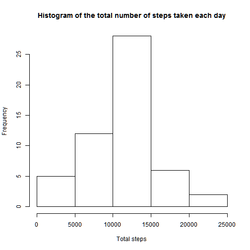
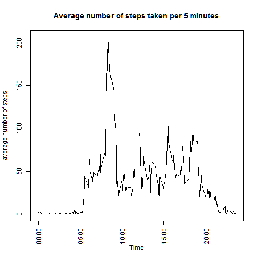
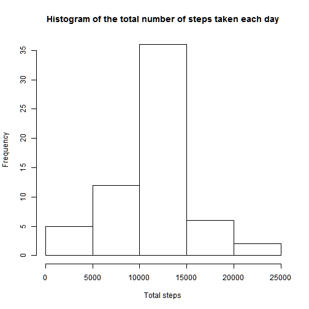
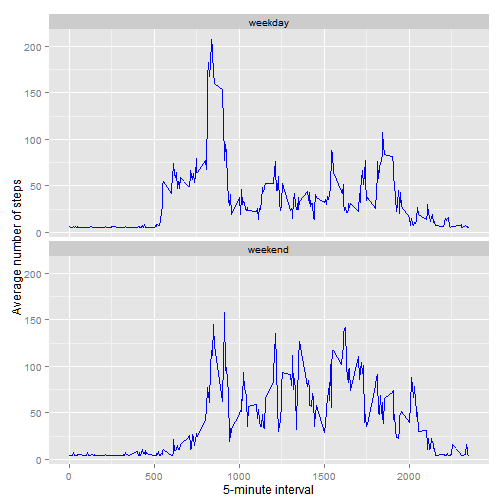

##Set global options

```r
library(knitr)
opts_chunk$set(echo=TRUE)
```


# Loading and preprocessing the data

```r
unzip("activity.zip")
MyDF<-read.csv('activity.csv',colClasses = c("integer","Date","integer"))
```

# What is mean total number of steps taken per day?


```r
library(dplyr)
#total number of steps taken per day
MyDF_group<-summarise(group_by(MyDF,date),total=sum(steps))
```

##A histogram of the total number of steps taken each day 

```r
hist(MyDF_group$total,xlab = "Total steps",main = "Histogram of the total number of steps taken each day")
```

 

##The mean of the total number of steps taken per day is 10766.19


```r
mean(MyDF_group$total,na.rm = TRUE)
```

```
## [1] 10766.19
```

##The median of the total number of steps taken per day is 10765


```r
median(MyDF_group$total,na.rm = TRUE)
```

```
## [1] 10765
```


# What is the average daily activity pattern?

```r
#avearge steps group by interval
MyDF_group_Time<-summarise(group_by(MyDF,interval),avg=mean(steps,na.rm = TRUE))
plot(MyDF_group_Time$interval,MyDF_group_Time$avg,type = "l",xlab = "Time",ylab = "average number of steps",axes = FALSE,main="Average number of steps taken per 5 minutes")
axis(2) #Y axis
axis(1, at=c(0,500,1000,1500,2000),labels =c("00:00","05:00","10:00","15:00","20:00"),las=2) #X axis with more nice labels
box()
```

 

#Find which 5-minute interval, on average across all the days in the dataset, contains the maximum number of steps

## The maximum number of steps is at 08:35 AM. (~206 steps)

```r
MyDF_group_Time[MyDF_group_Time$avg==max(MyDF_group_Time$avg),]
```

```
## Source: local data frame [1 x 2]
## 
##   interval      avg
## 1      835 206.1698
```


# Imputing missing values

## total number of rows with NAs is 2304

```r
length(MyDF[is.na(MyDF$steps),]$steps)
```

```
## [1] 2304
```

## Fill intervals with NA in steps based on the mean daily number of steps(divded by 288 which is the number of 5 minutes interval in a day).


```r
MyDF_groupNew<-MyDF_group # Duplicate the grouped d.f.
day_mean<-round(mean(MyDF_group$total,na.rm = TRUE )) #the daily mean of number of steps
MyDF_groupNew[is.na(MyDF_group$total),"total"]<-day_mean  # put the daily mean of number of steps instead on NA exiting in the daily d.f
q<-merge(MyDF,MyDF_groupNew) # merge the original d.f with the d.f that has the sum of daily number of steps
q[is.na(q[,"steps"]),]$steps <- round(q[is.na(q[,"steps"]),]$total/288) # fill the steps with NA with the daily number of steps in that day divided by 288
```

# Repeat the calcluation of Histogram, mean and median on the data fram that hasn't NA

```r
MyDF_group_noNA<-summarise(group_by(q,date),New_total=sum(steps)) 
```
##A histogram of the total number of steps taken each day 

```r
hist(MyDF_group_noNA$New_total,xlab = "Total steps",main = "Histogram of the total number of steps taken each day")
```

 

##The mean of the total number of steps taken per day is 10751.74


```r
mean(MyDF_group_noNA$New_total)
```

```
## [1] 10751.74
```
##The median of the total number of steps taken per day is 10656

```r
median(MyDF_group_noNA$New_total)
```

```
## [1] 10656
```

## These values differ from the estimates from the first part of the assignment, However thay are very close to the origina numbers, and there is almost no impact of imputing missing data on the estimates of the total daily number of steps

# Are there differences in activity patterns between weekdays and weekends?


```r
library(ggplot2)

Sys.setlocale("LC_TIME", "English") # Set English local to get english output from weekdays function
```

```
## [1] "English_United States.1252"
```

```r
q$DayType<-factor(weekdays(q$date,abbreviate = TRUE) %in% c('Sun','Sat'),labels = c('weekday','weekend'))
MyDF_groupDayType_Time<-summarise(group_by(q,DayType,interval),avg=mean(steps))
ggplot(MyDF_groupDayType_Time, aes(as.integer(interval),avg)) + geom_line(colour="blue") + facet_wrap(~ DayType   ,nrow = 2) + labs(x="5-minute interval", y="Average number of steps")
```

 

## There is a small chanage in the activity pattern: In weekends the activity start to raise a bit later in the morning compare to weekdays and start to get low a bit later in the evening compare to weekdays

